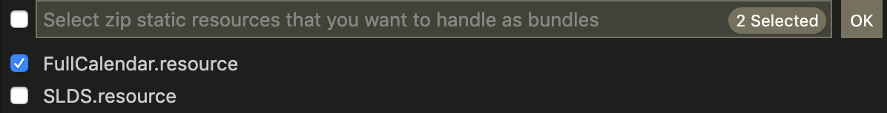
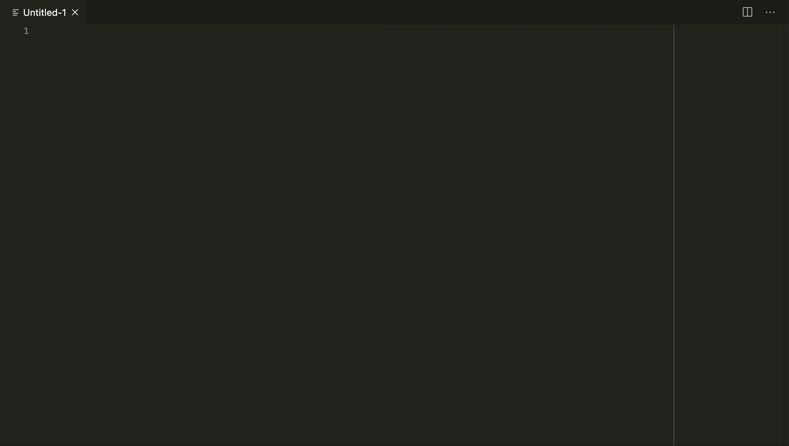

# fast-sfdc README

Standalone VSCode extension for fast development in the salesforce.com platform.
Built from scratch, no jsforce/salesforceDX dependencies, <b>LIGHTNING FAST!</b> ⚡️

## Features

### Deploy, Retrieve, Validate & Compile
Canonical deployment and retrieval of metadata based on your package.xml configuration is fully featured, but you can also deploy or retrieve single files/folders!
Compile on save for apex classes, visualforce pages, triggers, visualforce components, aura bundles and <b>lightning web components</b> is supported!

### Metadata Creation
Straightforward metadata creation and deployment for apex classes, visualforce pages & components, triggers, aura bundles, LWC.

#### NEW!!! 🔥 Offline Field Creation 🔥
You can create most of the supported fields and set the Profile FLS directly from the `Create new...` command. No more endless metadata retrieval and insane hunk versioning of profiles! This functionality is highly inspired by the excellent [swift-sfdc](https://marketplace.visualstudio.com/items?itemName=tr4uma.swift-sfdc) extension of [tr4uma](https://github.com/tr4uma). Thanks tr4uma for helping me to integrate this useful functionality

### Destructive changesets
Deleting metadata from your org is just easy as right-clicking on the metadata in the file explorer

### Metadata Patching
`fast-sfdc` uses [sfdy](https://www.npmjs.com/package/sfdy) as the engine to deploy and retrieve metadata. Thanks to that, it supports a bunch of useful metadata patches (see [here](https://github.com/micheletriaca/sfdy#apply-standard-patches-to-metadata-after-retrieve))

To setup a `.sfdy.json` config in your project, just open the command palette and type `Fast-Sfdc: Init metadata patching`

### Static resource bundles
Handle your static resources as uncompressed folders. Just select the static resource you want to handle as folders:

`fast-sfdc` will do the rest!

### Multi-org support
Store different credentials for fast org-switch and deploy when needed or in a hurry!

### 🔥 Lightning Web Components 🔥
<b>Full support for lightning web components</b>: from their creation to their deployment!

### Execute Anonymous
Run your code snippets directly from vscode. Buggy developer console is now a distant memory.

### Run tests
Just open a test class and click on the codelen

## Release Notes

See [here](CHANGELOG.md)
