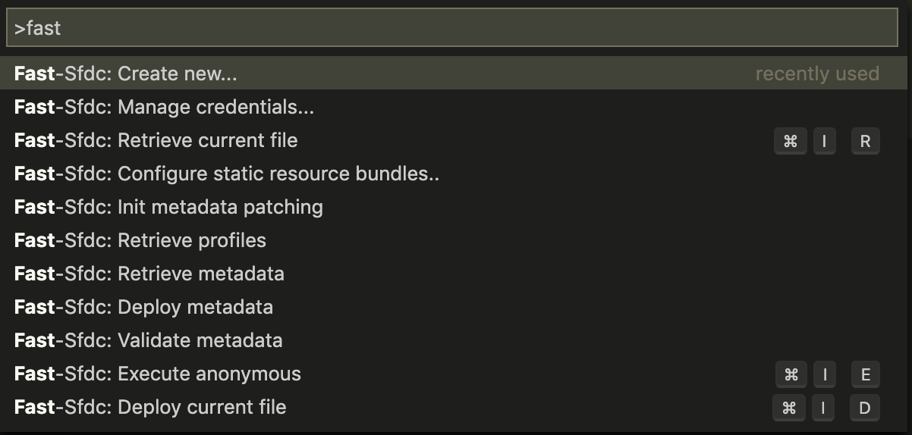
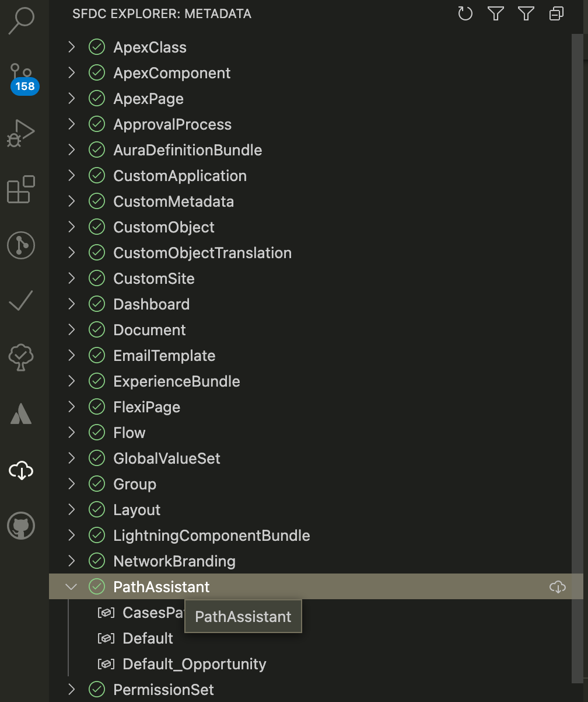
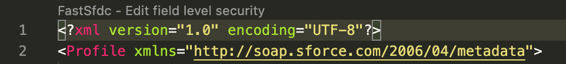
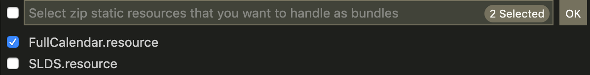
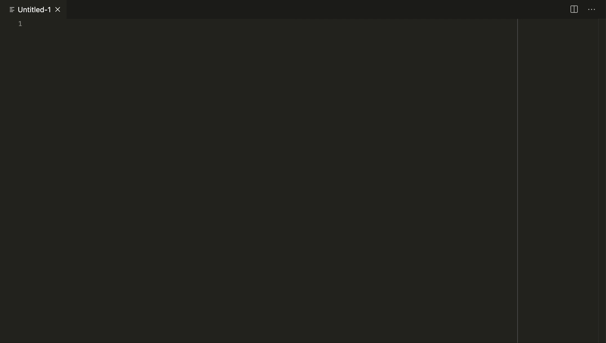
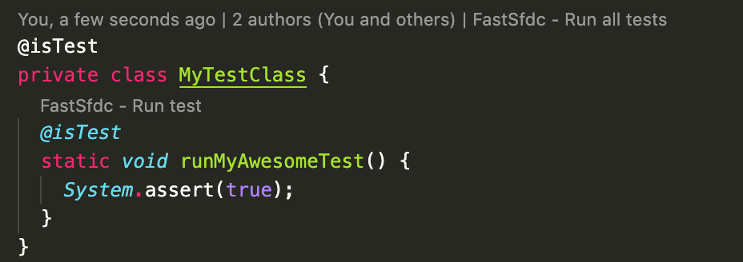

# fast-sfdc README

Standalone VSCode extension for fast development in the salesforce.com platform.
Built from scratch, no jsforce/salesforceDX dependencies, **LIGHTNING FAST!** ⚡️

## Features



### NEW!!! 🔥 Metadata explorer 🔥



Explore Metadata in your org and download from Salesforce everything you need. The retrieved metadata will be automatically added to package.xml

### NEW!!! 🔥 Authorize an org via OAuth2 flow 🔥

You can now authorize your org both using the canonical user+pass+token method or using an OAuth2 flow. The OAuth2 flow is useful if you have enforced MFA using the high assurance requirement on the profile. In this case, the user+pass+token flow will not work anymore

### Deploy, Retrieve, Validate & Compile

Canonical deployment and retrieval of metadata based on your package.xml configuration is fully featured, but you can also deploy or retrieve single files/folders!
Deploy on save for apex classes, Visualforce pages, triggers, Visualforce components, aura bundles and **lightning web components** is supported. Fast-Sfdc asks whether to enable it the first time an eligible file is saved for a credential; click the active credential in the status bar to change the preference later.

### Metadata Creation

Straightforward metadata creation and deployment for apex classes, Visualforce pages & components, triggers, aura bundles, and LWC.

#### Offline Field Creation

You can create most of the supported fields and set the Profile FLS directly from the `Create new...` command. No more endless metadata retrieval and insane hunk versioning of profiles! This functionality is highly inspired by the excellent [swift-sfdc](https://marketplace.visualstudio.com/items?itemName=tr4uma.swift-sfdc) extension of [tr4uma](https://github.com/tr4uma). Thanks, tr4uma for helping me to integrate this useful functionality


### Edit FLS directly from Profile or PermissionSet

Just open the Profile or PermissionSet and click on the codelen


### Destructive changesets

Deleting metadata from your org is just easy as right-clicking on the metadata in the file explorer

### Metadata Patching

`fast-sfdc` uses [sfdy](https://www.npmjs.com/package/sfdy) as the engine to deploy and retrieve metadata. Thanks to that, it supports a bunch of useful metadata patches (see [here](https://github.com/micheletriaca/sfdy#apply-standard-patches-to-metadata-after-retrieve))

To set up a `.sfdy.json` config in your project, just open the command palette and type `Fast-Sfdc: Init metadata patching`

`package.xml` is optional in both Metadata API and Salesforce DX projects. Fast-Sfdc derives
deploy and retrieve manifests from the local metadata tree; `.sfdy.json` supplies the API
version when it cannot be read from `sfdx-project.json`.

For Salesforce DX source-format projects, add:

```json
{
  "sourceFormat": "sfdx"
}
```

The default package directory is read from `sfdx-project.json` (for example,
`force-app/main/default`) and `package.xml` is not required. Use `sourceFolder` in
`.sfdy.json` only when the source root is non-standard.

### Static resource bundles

Handle your static resources as uncompressed folders. Just select the static resource you want to handle as folders:



`fast-sfdc` will do the rest!

### Multi-org support

Fast-Sfdc and the `sfdy` CLI share the encrypted project vault in
`.sfdy/credentials.vault`; only its encryption key is stored in the operating-system
keychain. The selected credential and Fast-Sfdc-specific preferences live in
`.sfdy/fast-sfdc.json`. Existing root-level `fastsfdc.json` files are migrated and removed
automatically.

### Lightning Web Components

**Full support for lightning web components**: from their creation to their deployment!

### Execute Anonymous

Run your code snippets directly from VSCode. Buggy developer console is now a distant memory.



### Run tests

Just open a test class and click on the codelen


## Release Notes

See [here](CHANGELOG.md)
